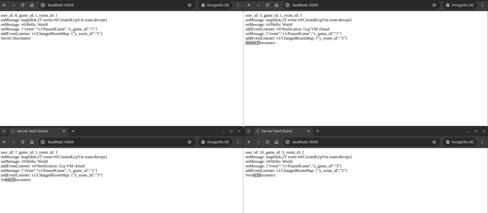
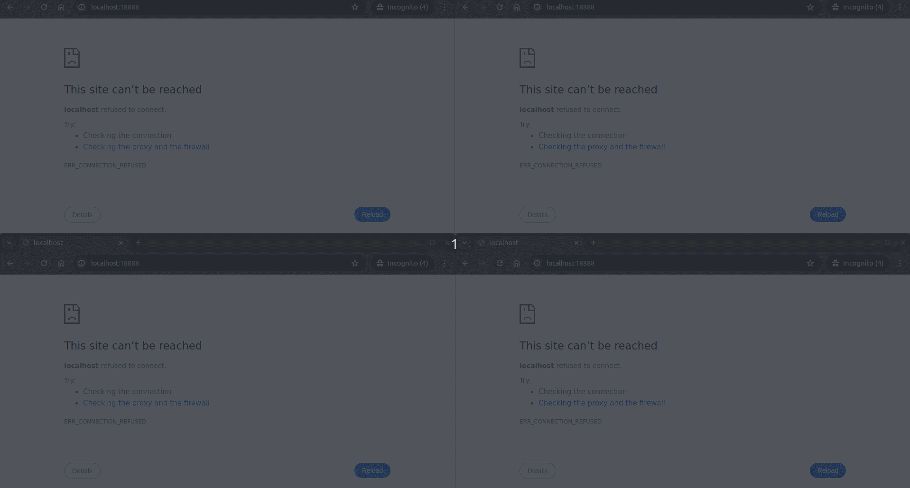

# Artifex-Adapter

Provide examples of implementing Artifex's adapters
- [Artifex-Adapter](#artifex-adapter)
	- [sse](#sse)
	- [rabbitmq](#rabbitmq)

## sse

[sse example](./sse/example/main.go)


```go
package main

func NewSseServer() *sse.Server {
	server := sse.DefaultServer()

	server.Authenticate = func(w http.ResponseWriter, r *http.Request, hub *sse.Hub) (sseId string, err error) {
		user_id := r.URL.Query().Get("user_id")
		return user_id, nil
	}

	once := sync.Once{}
	server.AdapterLifecycle = func(w http.ResponseWriter, r *http.Request, lifecycle *Artifex.Lifecycle) error {
		user_id := r.URL.Query().Get("user_id")
		game_id := r.URL.Query().Get("game_id")
		room_id := r.URL.Query().Get("room_id")

		lifecycle.OnOpen(func(adp Artifex.IAdapter) error {
			adp.Update(func(id *string, appData maputil.Data) {
				appData.Set("game_id", game_id)
				appData.Set("room_id", room_id)
			})

			fmt.Printf("%v %v %v enter: total=%v\n", user_id, game_id, room_id, server.Hub.Total())
			if server.Hub.Total() == 4 {
				once.Do(func() {
					close(mqFire)
				})
			}
			return nil
		})

		lifecycle.OnStop(func(adp Artifex.IAdapter) {
			fmt.Printf("%v %v %v leave: total=%v\n", user_id, game_id, room_id, server.Hub.Total())
		})
		return nil
	}

	root := server.Mux

	v0 := root.Group("v0/")
	v0.Middleware(sse.EncodeText().PreMiddleware())
	v0.SetDefaultHandler(broadcast(server.Hub))
	v0.Handler("Notification", Notification(server.Hub))

	v1 := root.Group("v1/")
	v1.PreMiddleware(sse.EncodeJson())
	v1.Handler("PausedGame", PausedGame(server.Hub))
	v1.Handler("ChangedRoomMap/{room_id}", ChangedRoomMap(server.Hub))

	fmt.Println()
	// [Artifex-SSE] event="v0/.*"                                  f="main.broadcast.func1"
	// [Artifex-SSE] event="v0/Notification"                        f="main.Notification.func1"
	// [Artifex-SSE] event="v1/ChangedRoomMap/{room_id}"            f="main.ChangedRoomMap.func1"
	// [Artifex-SSE] event="v1/PausedGame"                          f="main.PausedGame.func1"
	root.PrintEndpoints(func(subject, fn string) { fmt.Printf("[Artifex-SSE] event=%-40q f=%q\n", subject, fn) })

	return server
}

func NewHttpServer(sseServer *sse.Server) *http.Server {
	gin.SetMode(gin.ReleaseMode)
	router := gin.Default()

	router.StaticFile("/", "./index.html")
	router.GET("/stream", sse.HeadersByGin(true), sseServer.ServeByGin)

	httpServer := &http.Server{Handler: router, Addr: ":18888"}
	go func() {
		err := httpServer.ListenAndServe()
		if err != nil {
			fmt.Println("http server fail:", err)
		}
	}()

	return httpServer
}
```

sse result:  


sse gif:  


## rabbitmq

[rabbitmq example](./rabbit/example/main.go)


```go
func NewIngressMux() func() *rabbit.IngressMux {
	mux := rabbit.NewIngressMux()

	mux.Handler("key1-hello", func(message *rabbit.Ingress, _ *Artifex.RouteParam) error {
		message.Logger.Info("print key1-hello: %v", string(message.ByteBody))
		return nil
	})
	mux.Handler("key1-world", func(message *rabbit.Ingress, _ *Artifex.RouteParam) error {
		message.Logger.Info("print key1-world: %v", string(message.ByteBody))
		return nil
	})

	mux.Handler("key2.Created.Game", func(message *rabbit.Ingress, _ *Artifex.RouteParam) error {
		message.Logger.Info("print key2.Created.Game: %v", string(message.ByteBody))
		return nil
	})
	mux.Handler("key2.Restarted.Game", func(message *rabbit.Ingress, _ *Artifex.RouteParam) error {
		message.Logger.Info("print key2.Restarted.Game: %v", string(message.ByteBody))
		return nil
	})

	fmt.Println()
	for _, v := range mux.Endpoints() {
		fmt.Printf("[Rabbit Ingress] RoutingKey=%-40q f=%q\n", v[0], v[1])
	}

	return func() *rabbit.IngressMux {
		return mux
	}
}
```

```go
func NewEgressMux() func(ch **amqp.Channel) *rabbit.EgressMux {
	ctx := context.Background()

	return func(channel **amqp.Channel) *rabbit.EgressMux {
		mux := rabbit.NewEgressMux().
			Middleware(rabbit.EncodeJson().PreMiddleware())

		key1 := mux.Group("key1-")
		key1.SetDefaultHandler(func(message *rabbit.Egress, route *Artifex.RouteParam) error {
			return (*channel).PublishWithContext(
				ctx,
				"test-ex1",
				message.RoutingKey,
				false,
				false,
				amqp.Publishing{
					ContentType: "text/plain",
					MessageId:   message.MsgId(),
					Body:        message.ByteBody,
				},
			)
		})

		mux.Handler("key2.{action}.Game", func(message *rabbit.Egress, route *Artifex.RouteParam) error {
			return (*channel).PublishWithContext(
				ctx,
				"test-ex2",
				message.RoutingKey,
				false,
				false,
				amqp.Publishing{
					ContentType: "text/plain",
					MessageId:   message.MsgId(),
					Body:        message.ByteBody,
				},
			)
		})

		fmt.Println()
		for _, v := range mux.Endpoints() {
			fmt.Printf("[Rabbit Egress] RoutingKey=%-40q f=%q\n", v[0], v[1])
		}

		return mux
	}
}
```